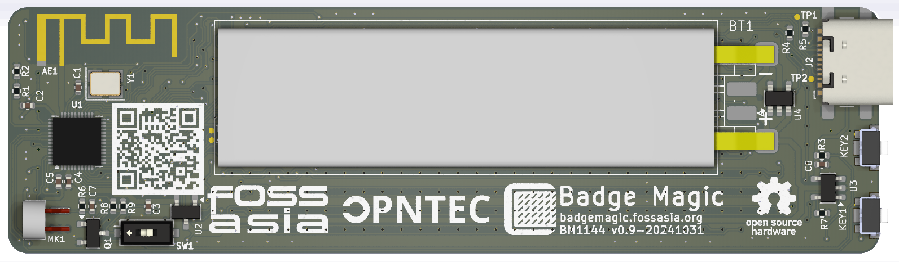

# badgemagic-hardware

This repository contains the [Badge Magic](https://badgemagic.fossasia.org) LED hardware design files. Magically Create Text and Draw Cliparts on LED Name Badges using Bluetooth.

The Badge Magic board app lets you create moving text and draw clipart for LED name badges using a mobile or desktop Python app. You can visualize portray names, cliparts, and simple animations on the badges. For the data transfer from the smartphone or desktop apps to the LED badge it uses Bluetooth.

## PCB Layout

**Front side**

**Back side**

## Applications and Firmware Source Repositories

The following software components are available:
* Firmware: https://github.com/fossasia/badgemagic-firmware
* Android app: https://github.com/fossasia/badgemagic-android

## Buy Device

* You can get a the board at the [FOSSASIA Shop](https://fossasia.com).

## Platform

* Microcontroller Platform: [WCH CH582M](https://www.wch.cn/products/CH583.html)
* Toolchain: [MRS_Toolchain_Linux_x64_V1.91](http://www.mounriver.com/download)
* Programming Tool: [wchisp](https://github.com/ch32-rs/wchisp)

## Parts list

- [WCH CH582M](https://www.wch.cn/products/CH583.html) Microcontroller
- [XC6206P332MR](https://www.torexsemi.com/file/xc6206/XC6206.pdf)
- [LP4054](https://xor.co.za/post/2022-11-30-hacking-smartwatch/LP4054-Lowpowersemi.pdf) 
- [DW03](https://wmsc.lcsc.com/wmsc/upload/file/pdf/v2/lcsc/2112031830_Shenzhen-Fuman-Elec-DW02R_C2927928.pdf)
- [USB-B Micro](https://mou.sr/3V4GnZ4)
- 32Mhz Crystal
- 3.7v 280mAh Li-ion batterry
- LEDs, buttons, resistors, capacitors.

## Hardware Specs

- 11x44 LED Matrix display
- BLE 5.0 
- USB 2.0

