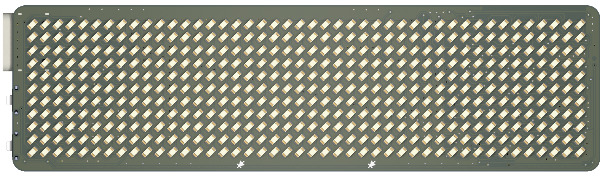

# Badge Magic Hardware

This repository contains the hardware design files for [Badge Magic](https://badgemagic.fossasia.org), an open-source LED badge platform that lets you create and display custom text, clipart, and animations over Bluetooth using the Badge Magic apps or Python libraries. While its latest hardware revision may not yet be mass-produced, it shares the same RISC-V chip as many other LED badges (e.g., LeSun, Victronics) but provides extra functionality, including a built-in microphone for real-time ambient sound visualization, external flash storage, and two top-mounted buttons that allow for mini-games and other interactive features. To see which functions are supported or in progress, visit the dedicated [firmware repository](https://github.com/fossasia/badgemagic-firmware). 

## PCB Layout

**Front side**

**Back side**

## Applications and Firmware Source Repositories

The following software components are available:
* Firmware: https://github.com/fossasia/badgemagic-firmware
* Android app: https://github.com/fossasia/badgemagic-app

## Buy Device

* You can get the board at the [FOSSASIA Shop](https://fossasia.com).

## Platform

* Microcontroller Platform: [WCH QingKe RISC-V Bluetooth](https://wch-ic.com/products/productsCenter/mcuInterface?categoryId=63)
* Toolchain: [MRS_Toolchain_Linux_x64_V1.91](http://www.mounriver.com/download)
* Programming Tool: [wchisp](https://github.com/ch32-rs/wchisp)

## Parts list

- [WCH CH582M(QFN48)](https://www.wch-ic.com/download/file?id=329) Microcontroller
- [XC6206P332MR](https://www.torexsemi.com/file/xc6206/XC6206.pdf)
- [LP4054](https://xor.co.za/post/2022-11-30-hacking-smartwatch/LP4054-Lowpowersemi.pdf) 
- [DW03](https://wmsc.lcsc.com/wmsc/upload/file/pdf/v2/lcsc/2112031830_Shenzhen-Fuman-Elec-DW02R_C2927928.pdf)
- [USB-C](https://www.usb.org/sites/default/files/documents/usb_type-c.zip)
- Electret microphone
- External flash storage
- 32Mhz Crystal
- 3.7v 280mAh Li-ion battery
- LEDs, buttons, resistors, capacitors,
- and [more](docs/bill-of-materials.csv)

## Hardware Specs

- 11x44 LED Matrix display
- BLE 5.3 
- USB 1.1

